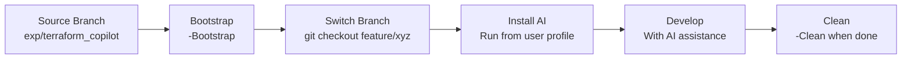

# AI Infrastructure Installer

> **Intelligent setup tool for AI-powered Terraform AzureRM Provider development**

This installer provides GitHub Copilot instructions, VS Code configurations, and AI-powered development workflows for the Terraform AzureRM Provider repository.

## 🚀 Getting Started

### First Time Setup

If you don't have the repository yet, clone it and switch to the AI installer branch:

```powershell
# Clone the repository
git clone https://github.com/hashicorp/terraform-provider-azurerm.git
cd terraform-provider-azurerm

# Switch to the AI installer source branch
git checkout exp/terraform_copilot

# Navigate to the installer
cd .github\AIinstaller

# Bootstrap the installer for use on feature branches
.\install-copilot-setup.ps1 -Bootstrap
```

### ⚠️ PowerShell Execution Policy

If you encounter execution policy errors, you have several options:

#### Option 1: Bypass for single execution (Recommended)
```powershell
# Run with execution policy bypass (safest for one-time use)
powershell -ExecutionPolicy Bypass -File .\install-copilot-setup.ps1 -Bootstrap

# Or for the user profile installer
powershell -ExecutionPolicy Bypass -File "$env:USERPROFILE\.terraform-ai-installer\install-copilot-setup.ps1"
```

#### Option 2: Unblock the downloaded files
```powershell
# Unblock all installer files
Get-ChildItem -Path . -Recurse | Unblock-File
.\install-copilot-setup.ps1 -Bootstrap
```

#### Option 3: Set execution policy for current user (Permanent)
```powershell
# Allow local scripts for current user
Set-ExecutionPolicy -ExecutionPolicy RemoteSigned -Scope CurrentUser
.\install-copilot-setup.ps1 -Bootstrap
```

## 🚀 Quick Start

### If you're on the source branch (`exp/terraform_copilot`):
```powershell
# 1. Bootstrap the installer
.\install-copilot-setup.ps1 -Bootstrap

# 2. Switch to your feature branch
git checkout feature/your-branch-name

# 3. Run installer from user profile
& "$env:USERPROFILE\.terraform-ai-installer\install-copilot-setup.ps1"
```

### If you're on a feature branch:
```powershell
# Run installer directly (if available locally)
.\install-copilot-setup.ps1
```

## 📋 What Gets Installed

The installer sets up a complete AI development environment:

### 📄 Core AI Instructions
- **`.github/copilot-instructions.md`** - Main Copilot configuration
- **`.github/instructions/`** - 14 specialized instruction files:
  - `implementation-guide.instructions.md` - Complete coding standards
  - `azure-patterns.instructions.md` - Azure-specific patterns
  - `testing-guidelines.instructions.md` - Testing requirements
  - `documentation-guidelines.instructions.md` - Doc standards
  - `error-patterns.instructions.md` - Error handling
  - `migration-guide.instructions.md` - Version migration
  - `provider-guidelines.instructions.md` - Provider patterns
  - `schema-patterns.instructions.md` - Schema design
  - `code-clarity-enforcement.instructions.md` - Code quality
  - `performance-optimization.instructions.md` - Performance
  - `security-compliance.instructions.md` - Security patterns
  - `troubleshooting-decision-trees.instructions.md` - Debugging
  - `api-evolution-patterns.instructions.md` - API versioning

### 🎨 Development Templates
- **`.github/prompts/`** - AI prompt templates for common tasks

### ⚙️ VS Code Configuration
- **`.vscode/settings.json`** - Optimized VS Code settings for Terraform development

### 🔧 Git Integration
- **`.gitignore`** updates - Automatic ignore patterns for AI files

## 🎛️ Command Reference

### Core Commands

| Command | Description | Available On |
|---------|-------------|--------------|
| `.\install-copilot-setup.ps1` | **Install AI infrastructure** | Feature branches |
| `.\install-copilot-setup.ps1 -Bootstrap` | **Copy installer to user profile** | Source branch only |
| `.\install-copilot-setup.ps1 -Verify` | **Check installation status** | Any branch |
| `.\install-copilot-setup.ps1 -Clean` | **Remove AI infrastructure** | Feature branches |
| `.\install-copilot-setup.ps1 -Help` | **Show detailed help** | Any branch |

### Modifiers

| Modifier | Description | Example |
|----------|-------------|---------|
| `-Auto-Approve` | Skip confirmation prompts | `.\install-copilot-setup.ps1 -Clean -Auto-Approve` |
| `-Dry-Run` | Preview changes without applying | `.\install-copilot-setup.ps1 -Clean -Dry-Run` |

## 🌊 Workflow Overview

### Branch-Aware Architecture

The installer adapts its behavior based on your current Git branch:

#### 🔹 Source Branch (`exp/terraform_copilot`)
- Contains the master AI infrastructure files
- **Bootstrap mode**: Copies installer to user profile for feature branch use
- **Verification**: Checks source files integrity
- **Protection**: Prevents accidental deletion of development files

#### 🔹 Feature Branches (any other branch)
- Target for AI infrastructure installation
- **Install mode**: Sets up complete AI development environment
- **Clean mode**: Removes AI infrastructure when needed
- **Verification**: Checks installed files status

### Typical Development Workflow



## 🏗️ Architecture

### Module Structure

```
AIinstaller/
├── install-copilot-setup.ps1      # Main entry point
├── README.md                      # This file
└── modules/powershell/            # PowerShell modules
    ├── ConfigParser.psm1          # Configuration management
    ├── FileOperations.psm1        # File installation/removal
    ├── ValidationEngine.psm1      # System validation
    └── UI.psm1                    # User interface functions
```

### Module Responsibilities

#### 📋 ConfigParser.psm1
- `Get-ManifestConfig` - File lists and target paths
- `Get-InstallationConfig` - Installation configuration
- `Get-FileDownloadUrl` - GitHub download URLs
- `ConvertTo-RelativePath` - Path utilities

#### 📁 FileOperations.psm1
- `Install-AllAIFiles` / `Remove-AllAIFiles` - Bulk operations
- `Install-AIFile` / `Remove-AIFile` - Individual file operations
- `Get-FileFromGitHub` - Remote file downloads
- `Update-GitIgnore` - Git ignore management
- `Test-FileIntegrity` - File validation

#### ✅ ValidationEngine.psm1
- `Test-SystemRequirements` - Validate prerequisites
- `Test-PreInstallation` / `Test-PostInstallation` - Installation checks
- `Test-WorkspaceValid` - Workspace validation
- `Get-ValidationReport` - Comprehensive status reports

#### 🎨 UI.psm1
- `Write-Success` / `Write-Warning` / `Write-Error` - Status messages
- `Show-Help` - Interactive help system
- `Confirm-UserAction` - User confirmations
- `Show-CompletionSummary` - Installation summaries

## 🔍 Usage Examples

### Check Current Status
```powershell
# See what's installed and what's missing
.\install-copilot-setup.ps1 -Verify
```

### Clean Installation
```powershell
# Remove all AI infrastructure (with confirmation)
.\install-copilot-setup.ps1 -Clean

# Remove without prompts
.\install-copilot-setup.ps1 -Clean -Auto-Approve

# Preview what would be removed
.\install-copilot-setup.ps1 -Clean -Dry-Run
```

### Bootstrap for Multiple Feature Branches
```powershell
# One-time setup from source branch
.\install-copilot-setup.ps1 -Bootstrap

# Then use from any feature branch
cd C:\your-terraform-projects\another-azurerm-fork
& "$env:USERPROFILE\.terraform-ai-installer\install-copilot-setup.ps1"
```

## 🛠️ Troubleshooting

### Common Issues

#### ❌ "Bootstrap can only be run from source branch"
**Solution**: Switch to `exp/terraform_copilot` branch before running bootstrap.

#### ❌ "Clean operation not available on source branch"
**Solution**: Switch to a feature branch before running clean operations.

#### ❌ Module import errors
**Solution**: Ensure you're running from the correct directory with all PowerShell modules present.

### Debug Mode

```powershell
# Check module loading
Get-Module ConfigParser, FileOperations, ValidationEngine, UI
```

### Manual Recovery

If the installer becomes corrupted:

```powershell
# Re-download from source branch
git switch exp/terraform_copilot
git pull origin exp/terraform_copilot
.\install-copilot-setup.ps1 -Bootstrap

# Then return to your branch
git switch your-feature-branch
```

## 🎯 Advanced Usage

### Automation Scripts

```powershell
# Automated setup for CI/CD
$params = @{
    'Auto-Approve' = $true
    'Verify' = $true
}
& .\install-copilot-setup.ps1 @params
```

### Custom Installation Paths

The installer respects environment variables:
- `$env:USERPROFILE\.terraform-ai-installer` - Bootstrap location
- Target paths are defined in the configuration manifest

### Integration with Other Tools

```powershell
# Check if AI infrastructure is installed (returns boolean)
$result = .\install-copilot-setup.ps1 -Verify
$isInstalled = $result.Success -and ($result.Issues.Count -eq 0)
```

## 📚 Additional Resources

- **[Implementation Guide](.github/instructions/implementation-guide.instructions.md)** - Complete coding standards
- **[Testing Guidelines](.github/instructions/testing-guidelines.instructions.md)** - Testing requirements
- **[Azure Patterns](.github/instructions/azure-patterns.instructions.md)** - Azure-specific development patterns
- **[Troubleshooting Guide](.github/instructions/troubleshooting-decision-trees.instructions.md)** - Debugging workflows

## 🤝 Contributing

### Development Setup

1. Fork the repository
2. Switch to `exp/terraform_copilot` branch
3. Make changes to installer files
4. Test with `-Bootstrap` and feature branch installation
5. Submit pull request

### Testing Changes

```powershell
# Test bootstrap functionality
.\install-copilot-setup.ps1 -Bootstrap

# Test installation on clean feature branch
git checkout -b test/installer-changes
& "$env:USERPROFILE\.terraform-ai-installer\install-copilot-setup.ps1" -Dry-Run

# Test cleanup
& "$env:USERPROFILE\.terraform-ai-installer\install-copilot-setup.ps1" -Clean -Dry-Run
```

## 📄 License

This installer is part of the Terraform AzureRM Provider and follows the same licensing terms.

---

**Need help?** Run `.\install-copilot-setup.ps1 -Help` for interactive assistance.
