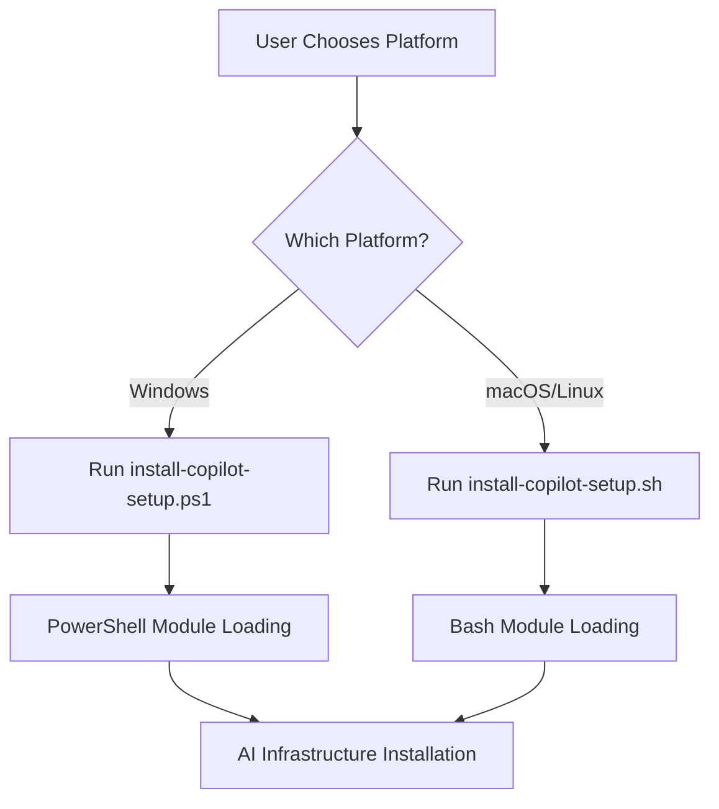

# AI Infrastructure Installer

> **Intelligent setup tool for AI-powered Terraform AzureRM Provider development**

This installer provides GitHub Copilot instructions, VS Code configurations, and AI-powered development workflows for the Terraform AzureRM Provider repository.

## 🌍 Cross-Platform Support

The installer supports **Windows**, **macOS**, and **Linux** with two simple platform choices:

### 🪟 Windows (PowerShell)
**Recommended for Windows environments:**
```powershell
.\install-copilot-setup.ps1 -Help
.\install-copilot-setup.ps1 -Bootstrap
.\install-copilot-setup.ps1 -RepoDirectory "C:\path\to\repo"
```

> ⚠️ **Note**: If you encounter PowerShell execution policy errors, see [Windows PowerShell Execution Policy](#windows---powershell-execution-policy) section below.

### 🐧 macOS/Linux (Bash)
**Recommended for Unix-like environments:**
```bash
./install-copilot-setup.sh -help
./install-copilot-setup.sh -bootstrap
./install-copilot-setup.sh -repo-directory "/path/to/repo"
```

### 🔧 Installation Paths
- **Windows**: `%USERPROFILE%\.terraform-ai-installer`
- **macOS/Linux**: `~/.terraform-ai-installer`

## ✨ User Experience

The installer provides a **clean, professional output** focused on what matters:

- **📋 Clear progress indicators** - Section headers and completion status
- **🎯 Focused messaging** - Only essential information, no technical noise
- **✅ Success confirmations** - Clear indication when operations complete
- **📊 File operation tracking** - Detailed file copy/install status
- **🎨 Consistent formatting** - Identical output quality across Windows PowerShell and macOS/Linux Bash

**Example output (consistent across Windows PowerShell and macOS/Linux Bash):**
```
============================================================
 Terraform AzureRM Provider - AI Infrastructure Installer
 Version: 1.0.0
============================================================

SOURCE BRANCH DETECTED: exp/terraform_copilot
WORKSPACE             : C:\github.com\hashicorp\terraform-provider-azurerm

============================================================
 Bootstrap - Copying Installer to User Profile
============================================================

PATH: C:\Users\<username>\.terraform-ai-installer

Copying installer files from local source repository...

   Copying: file-manifest.config [OK]
   Copying: install-copilot-setup.ps1 [OK]
   Copying: install-copilot-setup.sh [OK]
   Copying: ConfigParser.psm1 [OK]
   Copying: FileOperations.psm1 [OK]
   Copying: ValidationEngine.psm1 [OK]
   Copying: UI.psm1 [OK]
   Copying: configparser.sh [OK]
   Copying: fileoperations.sh [OK]
   Copying: validationengine.sh [OK]
   Copying: ui.sh [OK]

Bootstrap completed successfully!

  Files copied : 11
  Total size   : 170.6 KB
  Location     : C:\Users\<username>\.terraform-ai-installer

NEXT STEPS:

  1. Switch to your feature branch:
     git checkout feature/your-branch-name

  2. Run the installer from your user profile:
     
     # Windows PowerShell
     & "$env:USERPROFILE\.terraform-ai-installer\install-copilot-setup.ps1" -RepoDirectory "C:\github.com\hashicorp\terraform-provider-azurerm"
     
     # macOS/Linux Bash
     ~/.terraform-ai-installer/install-copilot-setup.sh -repo-directory "/path/to/terraform-provider-azurerm"

  Note: The -RepoDirectory parameter tells the installer where to find the git repository
        for branch detection when running from your user profile.
```

## 🚀 Getting Started

### 🌍 Cross-Platform Quick Start

Choose your platform and follow the two-step process:

**Windows (PowerShell):**
```powershell
# Step 1: Bootstrap (one-time setup)
.\install-copilot-setup.ps1 -Bootstrap

# Step 2: Install AI infrastructure (from user profile)
& "$env:USERPROFILE\.terraform-ai-installer\install-copilot-setup.ps1" -RepoDirectory "C:\path\to\terraform-provider-azurerm"
```

**macOS/Linux (Bash):**
```bash
# Step 1: Bootstrap (one-time setup)
./install-copilot-setup.sh -bootstrap

# Step 2: Install AI infrastructure (from user profile)
~/.terraform-ai-installer/install-copilot-setup.sh -repo-directory "/path/to/terraform-provider-azurerm"
```

### 📁 Directory Requirements

**Important**: The installer workflow has two phases:

**Phase 1 - Bootstrap (one-time setup):**
Choose your platform:

- **Windows**: `.\install-copilot-setup.ps1 -Bootstrap`  
- **macOS/Linux**: `./install-copilot-setup.sh -bootstrap`

> 💡 **Windows Tip**: If PowerShell blocks script execution, add `-ExecutionPolicy Bypass` (see troubleshooting below)

This copies the installer to your user profile:
- **Windows**: `%USERPROFILE%\.terraform-ai-installer`
- **macOS/Linux**: `~/.terraform-ai-installer`

**Phase 2 - All subsequent operations (after bootstrap):**
Run from your user profile:

- **Windows**: `& "$env:USERPROFILE\.terraform-ai-installer\install-copilot-setup.ps1" -RepoDirectory "C:\path\to\repo"`
- **macOS/Linux**: `~/.terraform-ai-installer/install-copilot-setup.sh -repo-directory "/path/to/repo"`

Works from any directory, any branch

### 📋 Prerequisites

Before using the AI-powered development features, ensure you have the following VS Code extensions installed:

#### Required Extensions
- **[GitHub Copilot](https://marketplace.visualstudio.com/items?itemName=GitHub.copilot)** - Core AI assistance and code generation
- **[GitHub Copilot Chat](https://marketplace.visualstudio.com/items?itemName=GitHub.copilot-chat)** - Interactive AI chat and slash commands

#### Recommended Configuration
For optimal performance and the best AI assistance experience:

- **LLM Model**: **Claude Sonnet 4** (optimal for Terraform and Go development)
- **Copilot Chat Model**: Set to `Claude Sonnet 4` in VS Code settings
- **Alternative**: GPT-4o (good alternative if Claude is unavailable)

#### Quick Setup
1. Install the required extensions from VS Code marketplace
2. Sign in to GitHub Copilot with your account
3. Configure `Claude Sonnet 4` as your preferred model:
   - Open VS Code Settings (`Ctrl+,`)
   - Search for "copilot chat model"
   - Select `Claude Sonnet 4` from the dropdown

**Note**: `Claude Sonnet 4` provides superior understanding of Terraform patterns, Azure API specifics, and Go code generation compared to other models.

### First Time Setup

If you don't have the repository yet, clone it and switch to the AI installer branch:

```bash
# Clone the repository
git clone https://github.com/hashicorp/terraform-provider-azurerm.git
cd terraform-provider-azurerm

# Switch to the AI installer source branch
git checkout exp/terraform_copilot

# Navigate to the installer
cd .github/AIinstaller
```

**Then choose your platform:**

**Windows:**
```powershell
# Bootstrap the installer
.\install-copilot-setup.ps1 -Bootstrap
```

**macOS/Linux:**
```bash
# Navigate to the installer
cd .github/AIinstaller

# Bootstrap the installer
./install-copilot-setup.sh -bootstrap
```

### ⚠️ Platform-Specific Considerations

#### Windows - PowerShell Execution Policy

If you encounter execution policy errors on Windows, you have several options:

##### Option 1: Bypass for single execution (Recommended)
```powershell
# Run with execution policy bypass (safest for one-time use)
powershell -ExecutionPolicy Bypass -File .\.github\AIinstaller\install-copilot-setup.ps1 -Bootstrap

# Or for the user profile installer
powershell -ExecutionPolicy Bypass -File "$env:USERPROFILE\.terraform-ai-installer\install-copilot-setup.ps1"
```

##### Option 2: Unblock the downloaded files
```powershell
# Unblock all installer files
Get-ChildItem -Path .\.github\AIinstaller -Recurse | Unblock-File
.\.github\AIinstaller\install-copilot-setup.ps1 -Bootstrap
```

##### Option 3: Set execution policy for current user (Permanent)
```powershell
# Allow local scripts for current user
Set-ExecutionPolicy -ExecutionPolicy RemoteSigned -Scope CurrentUser
.\.github\AIinstaller\install-copilot-setup.ps1 -Bootstrap
```

#### macOS/Linux - Script Permissions

If you encounter permission errors on macOS/Linux:

```bash
# Make scripts executable
chmod +x .github/AIinstaller/*.sh

# Then run the installer
./install-copilot-setup.sh -bootstrap
```

## 🚀 Quick Start

### Two-Step Process (Any Platform)

**Step 1: Bootstrap (One-time setup)**
Choose your platform for the bootstrap operation:

**Windows:**
```powershell
# From the source branch (exp/terraform_copilot)
.\.github\AIinstaller\install-copilot-setup.ps1 -Bootstrap
```

> ⚠️ **PowerShell Execution Policy**: If you get execution policy errors, run:
> ```powershell
> powershell -ExecutionPolicy Bypass -File .\.github\AIinstaller\install-copilot-setup.ps1 -Bootstrap
> ```

**macOS/Linux:**
```bash
# From the source branch (exp/terraform_copilot)
./.github/AIinstaller/install-copilot-setup.sh -bootstrap
```

**Step 2: Install AI Infrastructure (After bootstrap)**
Switch to your feature branch and run from user profile:

**Windows:**
```powershell
# Switch to your feature branch
git checkout feature/your-branch-name

# Run installer from user profile
& "$env:USERPROFILE\.terraform-ai-installer\install-copilot-setup.ps1" -RepoDirectory "C:\github.com\hashicorp\terraform-provider-azurerm"
```

**macOS/Linux:**
```bash
# Switch to your feature branch
git checkout feature/your-branch-name

# Run installer from user profile
~/.terraform-ai-installer/install-copilot-setup.sh -repo-directory "/path/to/terraform-provider-azurerm"
```

## 📋 What Gets Installed

The installer sets up a complete AI development environment:

### 📄 Core AI Instructions
- `.github/copilot-instructions.md` - Main Copilot configuration
- `.github/instructions/` - 14 specialized instruction files:
  - `implementation-guide.instructions.md` - Complete coding standards
  - `azure-patterns.instructions.md` - Azure-specific patterns
  - `testing-guidelines.instructions.md` - Testing requirements
  - `documentation-guidelines.instructions.md` - Doc standards
  - `error-patterns.instructions.md` - Error handling
  - `migration-guide.instructions.md` - Version migration
  - `provider-guidelines.instructions.md` - Provider patterns
  - `schema-patterns.instructions.md` - Schema design
  - `code-clarity-enforcement.instructions.md` - Code quality
  - `performance-optimization.instructions.md` - Performance
  - `security-compliance.instructions.md` - Security patterns
  - `troubleshooting-decision-trees.instructions.md` - Debugging
  - `api-evolution-patterns.instructions.md` - API versioning

### 🎨 Development Templates & AI Prompts
- `.github/prompts/` - AI prompt templates for common development tasks:

#### Available Prompts

| Prompt File | Purpose | Usage |
|-------------|---------|-------|
| `code-review-local-changes.prompt.md` | **Review uncommitted changes** with Terraform provider best practices | Use before committing to get expert feedback on your local changes |
| `code-review-committed-changes.prompt.md` | **Review committed changes** for pull request feedback | Use to review git commits with detailed technical analysis |

#### How to Use Prompts

**In GitHub Copilot Chat:**
**Prerequisites**: Requires [GitHub Copilot](https://marketplace.visualstudio.com/items?itemName=GitHub.copilot) and [GitHub Copilot Chat](https://marketplace.visualstudio.com/items?itemName=GitHub.copilot-chat) extensions. Use **Claude Sonnet 4** for optimal results.

Simply use slash commands to invoke the prompts directly:

| Slash Command | Prompt File | Description |
|---------------|-------------|-------------|
| `/code-review-local-changes` | `code-review-local-changes.prompt.md` | Review your uncommitted changes |
| `/code-review-committed-changes` | `code-review-committed-changes.prompt.md` | Review committed changes |

**Example Usage:**
```
/code-review-local-changes
/code-review-committed-changes
```

**For File-Specific Actions:**
```
/code-review-committed-changes for focusing on Azure patterns that have already been committed to your branch
/code-review-local-changes focusing on Azure patterns
```

### ⚙️ VS Code Configuration
- **`.vscode/settings.json`** - Optimized VS Code settings for Terraform development


## 🎛️ Command Reference

### Platform-Specific Commands

**Windows (PowerShell):**

| Command | Description | Available On |
|---------|-------------|--------------|
| `.\.github\AIinstaller\install-copilot-setup.ps1 -Bootstrap` | **Copy installer to user profile** (run from repository root) | Source branch only |
| `& "$env:USERPROFILE\.terraform-ai-installer\install-copilot-setup.ps1" -RepoDirectory "C:\path\to\repo"` | **Install AI infrastructure** (run from anywhere after bootstrap) | Feature branches |
| `& "$env:USERPROFILE\.terraform-ai-installer\install-copilot-setup.ps1" -Verify -RepoDirectory "C:\path\to\repo"` | **Check installation status** (run from anywhere after bootstrap) | Any branch |
| `& "$env:USERPROFILE\.terraform-ai-installer\install-copilot-setup.ps1" -Clean -RepoDirectory "C:\path\to\repo"` | **Remove AI infrastructure** (run from anywhere after bootstrap) | Feature branches |
| `& "$env:USERPROFILE\.terraform-ai-installer\install-copilot-setup.ps1" -Help` | **Show detailed help** (run from anywhere after bootstrap) | Any branch |

**macOS/Linux (Bash):**

| Command | Description | Available On |
|---------|-------------|--------------|
| `./.github/AIinstaller/install-copilot-setup.sh -bootstrap` | **Copy installer to user profile** (run from repository root) | Source branch only |
| `~/.terraform-ai-installer/install-copilot-setup.sh -repo-directory "/path/to/repo"` | **Install AI infrastructure** (run from anywhere after bootstrap) | Feature branches |
| `~/.terraform-ai-installer/install-copilot-setup.sh -verify -repo-directory "/path/to/repo"` | **Check installation status** (run from anywhere after bootstrap) | Any branch |
| `~/.terraform-ai-installer/install-copilot-setup.sh -clean -repo-directory "/path/to/repo"` | **Remove AI infrastructure** (run from anywhere after bootstrap) | Feature branches |
| `~/.terraform-ai-installer/install-copilot-setup.sh -help` | **Show detailed help** (run from anywhere after bootstrap) | Any branch |

### Parameters

**Windows (PowerShell):**

| Parameter | Description | Required When | Example |
|-----------|-------------|---------------|---------|
| `-RepoDirectory` | **Specify repository path** | Running from user profile | `-RepoDirectory "C:\path\to\terraform-provider-azurerm"` |
| `-Auto-Approve` | Skip confirmation prompts | Optional | `-Auto-Approve` |
| `-Dry-Run` | Preview changes without applying | Optional | `-Dry-Run` |

**macOS/Linux (Bash):**

| Parameter | Description | Required When | Example |
|-----------|-------------|---------------|---------|
| `-repo-directory` | **Specify repository path** | Running from user profile | `-repo-directory "/path/to/terraform-provider-azurerm"` |
| `-auto-approve` | Skip confirmation prompts | Optional | `-auto-approve` |
| `-dry-run` | Preview changes without applying | Optional | `-dry-run` |

### 🚨 Important: Repository Directory Parameter

When running the installer **from your user profile** (after bootstrap), you **MUST** specify the repository directory parameter:

*Windows:*
```powershell
# ✅ CORRECT: Running from user profile with RepoDirectory
& "$env:USERPROFILE\.terraform-ai-installer\install-copilot-setup.ps1" -RepoDirectory "C:\github.com\hashicorp\terraform-provider-azurerm"

# ❌ INCORRECT: Running from user profile without RepoDirectory
& "$env:USERPROFILE\.terraform-ai-installer\install-copilot-setup.ps1"
```

*macOS/Linux:*
```bash
# ✅ CORRECT: Running from user profile with -repo-directory
~/.terraform-ai-installer/install-copilot-setup.sh -repo-directory "/Users/<username>/terraform-provider-azurerm"

# ❌ INCORRECT: Running from user profile without -repo-directory
~/.terraform-ai-installer/install-copilot-setup.sh
```

**Why is this required?**
- The installer needs to know where your git repository is located
- Enables proper branch detection and workspace validation  
- Ensures files are installed in the correct repository directory

## 🌊 Workflow Overview

### Branch-Aware Architecture

The installer adapts its behavior based on your current Git branch:

#### 🔹 Source Branch (`exp/terraform_copilot`)
- Contains the master AI infrastructure files
- **Bootstrap mode**: Copies installer to user profile for feature branch use
- **Verification**: Checks source files integrity
- **Protection**: Prevents accidental deletion of development files

#### 🔹 Feature Branches (any other branch)
- Target for AI infrastructure installation
- **Install mode**: Sets up complete AI development environment
- **Clean mode**: Removes AI infrastructure when needed
- **Verification**: Checks installed files status

### Typical Development Workflow


## 🏗️ Architecture

### Two-Silo Architecture

```
AIinstaller/
├── install-copilot-setup.ps1      # Windows PowerShell installer
├── install-copilot-setup.sh       # macOS/Linux Bash installer
├── README.md                      # This file
├── file-manifest.config           # File configuration (shared)
└── modules/                       # Platform-specific modules
    ├── powershell/                # PowerShell modules (Windows)
    │   ├── ConfigParser.psm1      # Configuration management
    │   ├── FileOperations.psm1    # File installation/removal
    │   ├── ValidationEngine.psm1  # System validation
    │   └── UI.psm1                # User interface functions
    └── bash/                      # Bash modules (macOS/Linux)
        ├── configparser.sh        # Configuration management
        ├── fileoperations.sh      # File installation/removal
        ├── validationengine.sh    # System validation
        └── ui.sh                  # User interface functions
```

### Platform Detection & Execution Flow



### Module Responsibilities

#### 📋 ConfigParser.psm1
- `Get-ManifestConfig` - Parse manifest configuration and return structured data
- `Get-FileDownloadUrl` / `Get-FileLocalPath` - GitHub download URLs and local paths
- `Get-InstallerConfig` - Complete installer configuration

#### 📁 FileOperations.psm1
- `Install-AllAIFiles` / `Remove-AllAIFiles` - Bulk file operations
- `Install-AIFile` / `Remove-AIFile` - Individual file operations
- `Get-GitHubFileContent` / `Get-FileFromGitHub` - Remote file downloads
- `Update-GitIgnore` / `Get-GitIgnoreStatus` - Git ignore management
- `Test-FileIntegrity` / `Backup-ExistingFile` - File validation and backup
- `Remove-DeprecatedFiles` / `Invoke-Bootstrap` - Cleanup and bootstrap operations

#### ✅ ValidationEngine.psm1
- `Test-SystemRequirements` / `Test-RequiredCommands` - System prerequisites
- `Test-PreInstallation` / `Test-PostInstallation` - Installation state checks
- `Test-WorkspaceValid` / `Test-GitRepository` - Workspace and git validation
- `Test-AIInfrastructure` / `Test-InstallationDependencies` - Infrastructure checks
- `Get-ValidationReport` / `Get-CurrentBranch` - Status reporting and branch detection
- `Find-WorkspaceRoot` / `Test-SourceRepository` - Repository discovery and validation

#### 🎨 UI.psm1
- `Write-Success` / `Write-WarningMessage` / `Write-ErrorMessage` - Status messages
- `Show-Help` / `Show-SourceBranchHelp` / `Show-FeatureBranchHelp` - Interactive help
- `Show-CompletionSummary` / `Show-InstallationResults` - Operation summaries
- `Get-UserInput` / `Get-BootstrapConfirmation` - User interaction
- `Show-BranchDetection` / `Show-ContextualError` - Branch-aware messaging
- `Write-Header` / `Write-Section` / `Format-AlignedLabel` - UI formatting

## 🎯 AI Prompt Usage Patterns

### Quick Start with Prompts

Once the AI infrastructure is installed, you can leverage the powerful prompt templates for common development tasks:

#### 🔍 Code Review Workflow
```
# Review your current changes before committing
/code-review-local-changes

# Review specific committed changes
/code-review-committed-changes for commit abc123
```

### Advanced Prompt Techniques

#### 🎯 Context-Specific Usage
Combine slash commands with specific context for better results:

```
# Review specific Azure service implementation
/code-review-local-changes focusing on Azure CDN Front Door patterns

# Review changes with specific focus areas
/code-review-committed-changes and ensure Azure SDK integration follows best practices
```

#### 🔄 Iterative Development
Use slash commands in sequence for complete development workflows:

```
1. # Review your implementation patterns against Azure provider guidelines
2. # Make your code changes
3. /code-review-local-changes before committing
4. /code-review-committed-changes after committing for final review
```

#### 🎨 Custom Prompt Combinations
Combine multiple commands for complex tasks:

```
# Comprehensive development review
/code-review-local-changes AND ensure the code follows Azure patterns from .github/instructions/
```

## 🔍 Usage Examples

### Check Current Status
```powershell
# After bootstrap - run from anywhere using user profile installer
& "$env:USERPROFILE\.terraform-ai-installer\install-copilot-setup.ps1" -Verify -RepoDirectory "C:\github.com\hashicorp\terraform-provider-azurerm"
```

### Clean Installation
```powershell
# After bootstrap - run from anywhere using user profile installer
& "$env:USERPROFILE\.terraform-ai-installer\install-copilot-setup.ps1" -Clean -RepoDirectory "C:\github.com\hashicorp\terraform-provider-azurerm"

# Remove without prompts
& "$env:USERPROFILE\.terraform-ai-installer\install-copilot-setup.ps1" -Clean -Auto-Approve -RepoDirectory "C:\github.com\hashicorp\terraform-provider-azurerm"

# Preview what would be removed
& "$env:USERPROFILE\.terraform-ai-installer\install-copilot-setup.ps1" -Clean -Dry-Run -RepoDirectory "C:\github.com\hashicorp\terraform-provider-azurerm"
```

### Bootstrap for Multiple Feature Branches
```powershell
# One-time setup from source branch (run from repository root)
.\.github\AIinstaller\install-copilot-setup.ps1 -Bootstrap

# Then use from any feature branch (MUST specify RepoDirectory)
& "$env:USERPROFILE\.terraform-ai-installer\install-copilot-setup.ps1" -RepoDirectory "C:\github.com\hashicorp\terraform-provider-azurerm"

# For different repository locations
& "$env:USERPROFILE\.terraform-ai-installer\install-copilot-setup.ps1" -RepoDirectory "C:\your-projects\another-azurerm-fork"
```

## 🛠️ Troubleshooting

### Common Issues

#### ❌ "Bootstrap can only be run from source branch"
**Solution**: Switch to `exp/terraform_copilot` branch before running bootstrap.

#### ❌ "Clean operation not available on source branch"
**Solution**: Switch to a feature branch before running clean operations.

#### ❌ "DIRECTORY NOT FOUND: The specified RepoDirectory does not exist"
**Solution**: 
- Check the path spelling and ensure it exists
- Use an absolute path (e.g., `C:\path\to\repo`)
- Ensure you have permissions to access the directory

#### ❌ "INVALID REPOSITORY: The specified directory does not appear to be a terraform-provider-azurerm repository"
**Solution**:
- Ensure you're pointing to the repository ROOT directory
- Verify the directory contains `go.mod`, `main.go`, and `internal/` folder
- Example: `-RepoDirectory 'C:\github.com\hashicorp\terraform-provider-azurerm'`

#### ❌ Module import errors
**Solution**: Ensure you're running from the correct directory with all PowerShell modules present.

### Manual Recovery

If the installer becomes corrupted:

```powershell
# Re-download from source branch
git switch exp/terraform_copilot
git pull origin exp/terraform_copilot
.\.github\AIinstaller\install-copilot-setup.ps1 -Bootstrap

# Then return to your branch
git switch your-feature-branch
```

## 📚 Additional Resources

- **[Implementation Guide](.github/instructions/implementation-guide.instructions.md)** - Complete coding standards
- **[Testing Guidelines](.github/instructions/testing-guidelines.instructions.md)** - Testing requirements
- **[Azure Patterns](.github/instructions/azure-patterns.instructions.md)** - Azure-specific development patterns
- **[Troubleshooting Guide](.github/instructions/troubleshooting-decision-trees.instructions.md)** - Debugging workflows

## 📄 License

This installer is part of the Terraform AzureRM Provider and follows the same licensing terms.

---

**Need help?** Run `.\install-copilot-setup.ps1 -Help` for interactive assistance.
