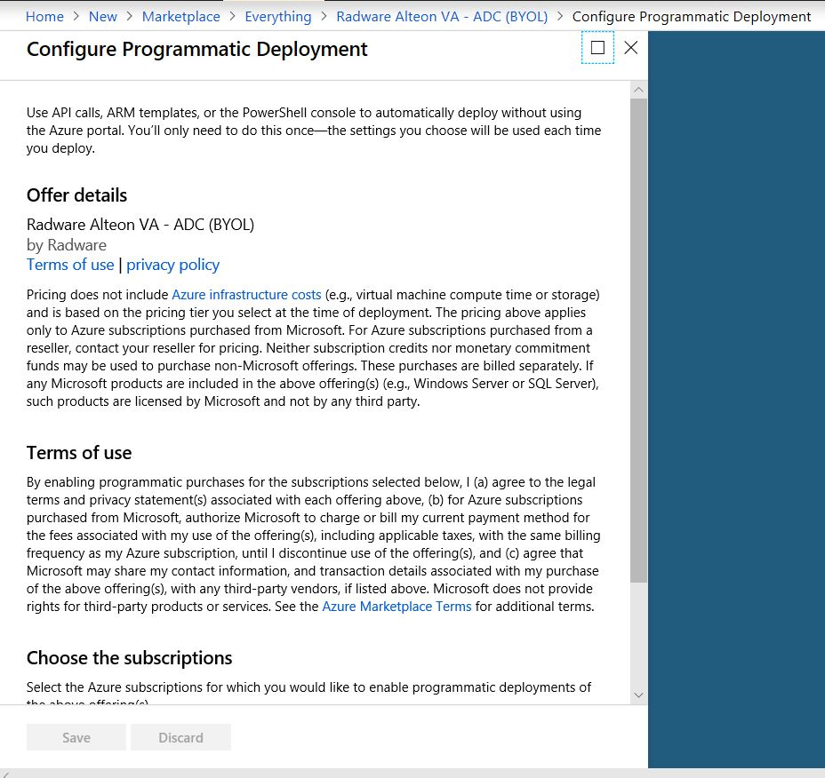

## Example: Deploying a Virtual Machine from a Azure Marketplace image

This example provisions a Virtual Machine from an Azure Marketplace image.

---

### Note

The Terms and Conditions must be accepted for a marketplace image prior to being able to use it (one time per subscription). At this time Terraform doesn't do this for you - however support for this is being tracked in XXX and will be added in a future release.

As such in order to run this example you may need to accept the T&C's for the Marketplace image - which can be done in one of two ways.

To accept the Terms & Conditions for the Marketplace image via PowerShell, you can [use the `Set-AzureRmMarketplaceTerms` Cmdlet](https://docs.microsoft.com/en-us/powershell/module/azurerm.marketplaceordering/set-azurermmarketplaceterms?view=azurermps-6.13.0) - for example:

```powershell
> Set-AzureRmMarketplaceTerms -Publisher "radware" -Product "radware-alteon-va" -Name "radware-alteon-ng-va-adc" -Accept
```

It's then possible to see the status by using the `Get-AzureRmMarketplaceTerms` Cmdlet:

```powershell
> Get-AzureRmMarketplaceTerms -Publisher "radware" -Product "radware-alteon-va" -Name "radware-alteon-ng-va-adc"
```

---

Alternatively you can accept the Terms & Conditions through the Azure Portal.

To do this, search for and select the solution in Azure Marketplace, then scroll down and click on "want to deploy programmatically?"


scroll down and click on "Enable" and then "Save"



Additional information on [working with Marketplace Images in the Azure Portal can be found here](https://azure.microsoft.com/en-us/blog/working-with-marketplace-images-on-azure-resource-manager/).
