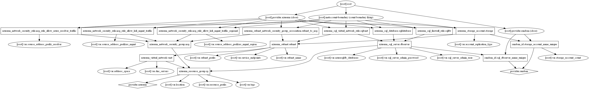

# Secure Virtual Network for HDInsight

This template deploys a secure "spoke" Azure Virtual Network for use with a Azure HDInsight as described in the following blog posts:
* [How to enhance HDInsight security with service entpoints](https://azure.microsoft.com/en-us/blog/enhance-hdinsight-security-with-service-endpoints/)
* [Secure incoming traffic to HDInsight clusters in a virtual network with private endpoint](https://azure.microsoft.com/en-us/blog/secure-incoming-traffic-to-hdinsight-clusters-in-a-vnet-with-private-endpoint/) 

This template can also be used to optionally deploy additional Azure Services used by HDInsight, including:
* Azure Storage accounts 
* Azure SQL Databases

This template does not deploy HDInsight because the Azure provider for Terraform does not currently support HDInsight. It does however deploy the necessary infrastructure required to do a private and secure deployment of HDInsight. After using this template, you must manually install HDInsight using the Azure Portal or an ARM Template. 

## 01-providers.tf
Configures providers. Azure requires that an application is added to Azure Active Directory to generate the `client_id`, `client_secret`, and `tenant_id` needed by Terraform (`subscription_id` can be recovered from your Azure account details). Please go [here](https://www.terraform.io/docs/providers/azurerm/) for full instructions on how to create this to populate your `provider.tf` file.

## 02-rg.tf
Configures an Azure Resource Group.

## 03-vnet.tf
Configures a "spoke" Azure Virtual Network with single subnet, as well as a Network Security Group used to secure HDInsight management traffic. In order to enable connectivity with your on-premises netwok, the "spoke" Virtual Network must be manually peered with an exiswting "hub" virtual Network after it is provisioned. For more information on hybrid connectivity and hub-spoke topologies, see [Choose a solution for connecting an on-premises network to Azure](https://docs.microsoft.com/en-us/azure/architecture/reference-architectures/hybrid-networking/).

## 04-storage.tf
Optionally configures one or more Azure Storage accounts to be used with HDInsight and locks them down to use the service enpoints defined in `03-vnet.tf`.

## 05-sql.tf
Optionally configures one or mre Azure SQL Databases to be used with HDInsight and locks them down to use the service endpoints defined in `03-vnet.tf`.

## terraform.tfvars
Defines the variables used in this template. Note that several static variable definitions are included that may be dated, be sure to check the Azure documentation for updates. If a `terraform.tfvars` or any `.auto.tfvars` files are present in the current directory, Terraform automatically loads them to populate variables. We don't recommend saving usernames and password to version control, but you can create a local secret variables file and use the `-var-file` flag or the `.auto.tfvars` extension to load it.

## variables.tf
The `variables.tf` file contains all of the input parameters that the user can specify when deploying this Terraform template. A sample is provided in this template that you can customize for your environment.

